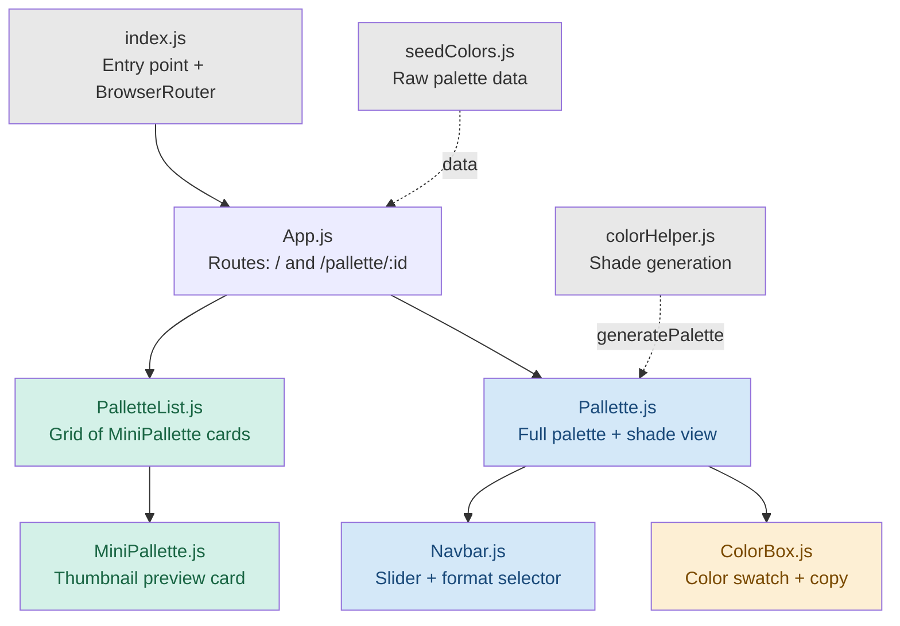
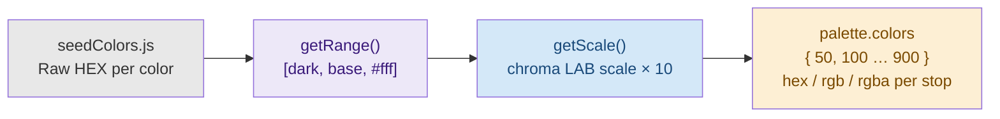
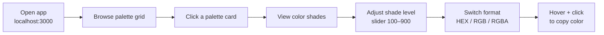
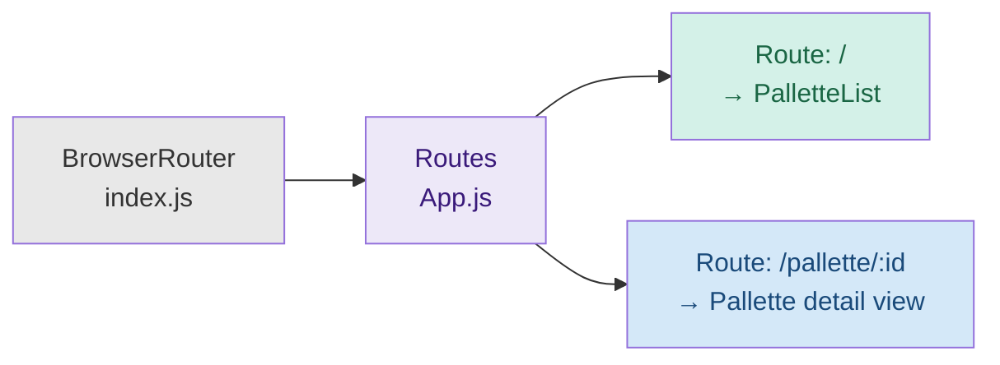

# 🎨 Kolors — Color Palette Explorer

[](https://opensource.org/licenses/MIT)
[](https://react.dev/)
[](https://www.npmjs.com/)
[](https://nodejs.org/en)
[](https://mui.com/)

> A delightful React web application for browsing, visualizing, and copying curated color palettes with automatic shade generation.

---

## 📋 Table of Contents

- [Overview](#overview)
- [Key Features](#key-features)
- [Architecture](#architecture)
- [Data Flow](#data-flow)
- [User Workflow](#user-workflow)
- [File Structure](#file-structure)
- [State Management](#state-management)
- [Routing](#routing)
- [Dependencies](#dependencies)
- [Getting Started](#getting-started)
- [Potential Improvements](#potential-improvements)
- [Contributing](#contributing)
- [License](#license)

---

## Overview

**Kolors** is a React application that lets designers and developers explore curated color palettes from around the world. Each palette is displayed as a grid of shades — from light tints to dark tones — and any color value can be copied to clipboard with a single click. Think of it as a personal Pantone book that lives in your browser.

| Stat | Value |
|------|-------|
| Palettes included | 10+ (Material UI, Flat UI, regional collections) |
| Shade levels per color | 10 (50 → 900) |
| Copy formats | 3 (HEX, RGB, RGBA) |
| Copy-to-clipboard | ✅ One-click |
| Responsive | ✅ Mobile, tablet, desktop |

---

## Key Features

- **Browse a diverse collection** — Explore palettes from Material UI, Flat UI v1/v2, and country-themed sets (🇮🇳 Indian, 🇫🇷 French, 🇬🇧 British, 🇳🇱 Dutch, 🇺🇸 American, 🇦🇺 Aussie, 🇪🇸 Spanish).
- **Detailed palette view** — Click any palette card to open a full 5×4 grid of color shades. A slider lets you jump between shade levels (100–900).
- **Copy in any format** — Switch between HEX, RGB, and RGBA via the navbar dropdown. Hover a color box and click to copy; a "Copied!" overlay confirms instantly.
- **Responsive layout** — Palette list collapses 3 → 2 → 1 columns across breakpoints (992px, 600px). Color boxes stack vertically on mobile (≤768px). Shade slider is hidden on small screens.
- **Seamless navigation** — Powered by `react-router` v7 for smooth transitions between the list and detail views.

---

## Architecture

The component tree below shows how data flows from seed color data through helper functions down to individual color boxes.



---

## Data Flow

The core logic lives in `colorHelper.js`. It takes a seed color (e.g. `#F44336`) and uses `chroma-js` to produce a 10-stop scale from a darkened version through to white, using LAB color space interpolation for perceptually even steps.



**How shade levels work:**

Each stop (50–900) holds an array of all colors at that lightness level. When the slider moves to `300`, `Pallette.js` reads `palette.colors[300]` and renders one `ColorBox` per color.

```
Level 50   → lightest tints (near white)
Level 500  → base colors (original hex)
Level 900  → darkest shades (near black)
```

---

## User Workflow



---

## File Structure

```
kolors/
├── public/
│   ├── index.html          # HTML shell; React mounts into #root
│   └── manifest.json       # PWA metadata
├── src/
│   ├── App.js              # Root component — declares two Route paths
│   ├── App.css             # Global layout styles
│   ├── index.js            # Entry point — mounts app inside BrowserRouter
│   ├── components/
│   │   ├── ColorBox/
│   │   │   ├── ColorBox.js     # Single color swatch with copy-to-clipboard
│   │   │   └── ColorBox.css
│   │   ├── MiniPallette/
│   │   │   └── MiniPallette.js # Thumbnail preview card for palette list
│   │   ├── Navbar/
│   │   │   ├── Navbar.js       # Shade slider + format selector + snackbar
│   │   │   └── Navbar.css
│   │   ├── Pallette/
│   │   │   ├── Pallette.js     # Detail view — full shade grid
│   │   │   └── Pallette.css
│   │   └── PalletList/
│   │       └── PalletteList.js # Responsive grid of MiniPallette cards
│   ├── helper/
│   │   ├── colorHelper.js      # generatePalette(), getScale(), getRange()
│   │   └── seedColors.js       # Raw palette data array
│   └── assets/
│       └── bg.svg              # Background SVG for the palette list page
└── package.json
```

### Key files explained

| File | Role |
|------|------|
| `seedColors.js` | Array of palette objects — each has a `paletteName`, `id`, `emoji`, and an array of `{ name, color }` pairs |
| `colorHelper.js` | `generatePalette()` builds a 10-stop shade map using chroma-js LAB interpolation. Exposes `getScale()` and `getRange()` |
| `PalletteList.js` | Responsive CSS Grid of `MiniPallette` cards. Navigates to detail page on click via `useNavigate()` |
| `MiniPallette.js` | Thumbnail card: a 5×4 mini color grid + palette name + emoji. Styled via `withStyles()` |
| `Pallette.js` | Reads `:id` param, calls `generatePalette()`, renders a 5×4 grid of `ColorBox`. Owns `level` + `format` state |
| `Navbar.js` | Header with `rc-slider` (shade level 100–900), MUI `Select` (HEX/RGB/RGBA), and a `Snackbar` for format-change feedback |
| `ColorBox.js` | Single color swatch. Wraps content in `CopyToClipboard`; shows "Copy"/"Copied!" overlay on hover/click |

---

## State Management

Kolors uses only **local React state** — no Redux or context. Each component owns what it needs.

| Component | State | Purpose |
|-----------|-------|---------|
| `Pallette.js` | `level` (100–900) | Controls which shade level is displayed |
| `Pallette.js` | `format` (`hex`/`rgb`/`rgba`) | Controls copy format passed to ColorBox |
| `Pallette.js` | `palette` (generated object) | The full shade map, built on mount via `useEffect` |
| `Navbar.js` | `format` | Local mirror; emits changes up to `Pallette` via callback prop |
| `Navbar.js` | `open` | Snackbar visibility (format-changed toast) |
| `ColorBox.js` | `copied` | Shows "Copied!" overlay for 1.5s after click |
| `ColorBox.js` | `isHovering` | Reveals the copy button on hover |

---

## Routing



- `/` — Renders `PalletteList` with all seed palettes passed as props
- `/pallette/:id` — Renders `Pallette`, which reads the `:id` param, finds the matching seed palette, and generates the full shade map

---

## Dependencies

### Runtime

| Package | Version | Purpose |
|---------|---------|---------|
| `react` | ^19.1.0 | UI framework |
| `react-dom` | ^19.1.0 | DOM renderer |
| `react-router` | ^7.5.1 | Client-side routing |
| `chroma-js` | ^3.1.2 | Color manipulation + shade generation |
| `@mui/material` | ^7.0.2 | UI components (Select, Snackbar, Button) |
| `@mui/icons-material` | ^7.0.2 | MUI icon set (CloseIcon) |
| `@material-ui/styles` | ^4.11.5 | Legacy `withStyles()` HOC |
| `@emotion/react` | ^11.14.0 | MUI peer dependency (CSS-in-JS) |
| `@emotion/styled` | ^11.14.0 | MUI peer dependency |
| `rc-slider` | ^11.1.8 | Shade level slider in Navbar |
| `react-copy-to-clipboard` | ^5.1.0 | One-click color value copying |

> **Note:** `@material-ui/styles` (v4) and `@mui/material` (v7) coexist. The older package is used only for `withStyles()` in `MiniPallette` and `PalletteList`. These can be migrated to MUI v7's `styled()` or `sx` API in a future refactor.

### Dev / Test

| Package | Purpose |
|---------|---------|
| `react-scripts` 5.0.1 | CRA build toolchain |
| `@testing-library/react` | Component testing |
| `@testing-library/jest-dom` | DOM matchers |
| `web-vitals` | Performance metrics |

---

## Getting Started

### Prerequisites

- Node.js v18.15.0+
- npm v9.5.0+

### Installation

**1. Clone the repository**

```bash
git clone https://github.com/thamizh-root/kolors.git
cd kolors
```

**2. Install dependencies**

```bash
npm install
```

**3. Start the development server**

```bash
npm start
# Runs at http://localhost:3000
```

**4. Build for production**

```bash
npm run build
```

**5. Run tests**

```bash
npm test
```

---

## Potential Improvements

- [ ] **Custom palette creation** — Allow users to add their own base colors and generate a new palette on the fly, saved to `localStorage`.
- [ ] **Search & filter** — A search bar on the list page to filter palettes by name or country.
- [ ] **MUI v7 migration** — Replace legacy `@material-ui/styles` (v4) with MUI v7's `styled()` or `sx` prop to eliminate the version mismatch.
- [ ] **Accessibility pass** — Add ARIA labels to color boxes, keyboard navigation for the palette grid, and color-name contrast checks.
- [ ] **Dark mode** — Add a theme toggle using MUI's `ThemeProvider`.
- [ ] **Export palette** — Download a palette as a CSS variables file or JSON.

---

## Contributing

Contributions are welcome! Please follow these steps:

1. **Fork** the repository on GitHub.
2. **Create a branch**: `git checkout -b feature/your-feature-name`
3. **Make your changes** and commit with a descriptive message: `git commit -m "Add your feature"`
4. **Push** to your fork: `git push origin feature/your-feature-name`
5. **Open a pull request** on the main repository.

Please check for open issues before starting work on a new feature.

---

## License

This project is licensed under the [MIT License](https://opensource.org/licenses/MIT) — see the [LICENSE](LICENSE) file for details.

Copyright © 2025 [Thamizh Munusamy](https://github.com/thamizh-root)

---

<p align="center">
  ⭐ Star the repo if you find it useful &nbsp;·&nbsp; 🐛 Report issues &nbsp;·&nbsp; 💡 Suggest features
</p>